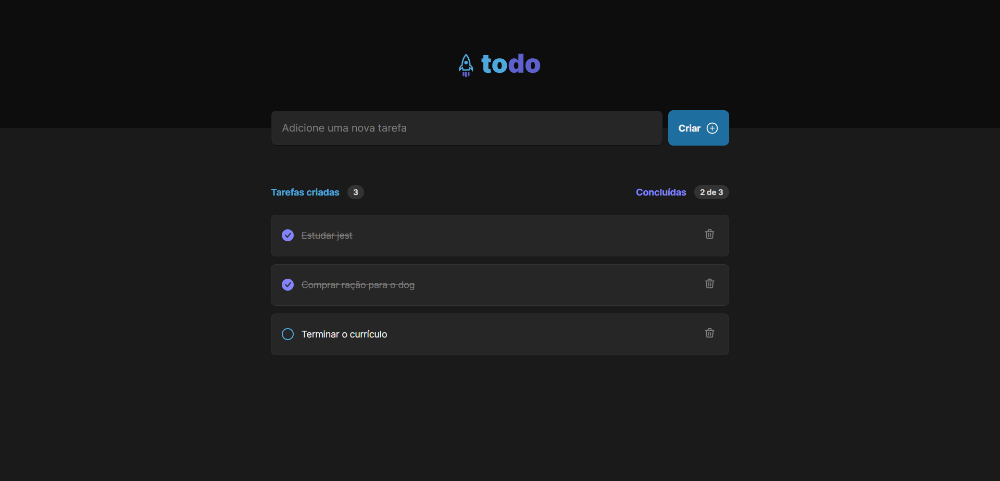

<div align="center">
 
[](#)
 
 </div>

<h1 align="Star">
    toDo
</h1>



<p align="center"><a href="https://www.figma.com/file/F2M65bUd25vOCNfdvmeDTk/Minimal-Finance-Dashboard-(Community)?node-id=0%3A1&t=srSRkEelB2XBeXZb-0">toDo</a>  for study purposes. <a href="https://inspiring-crisp-5f0662.netlify.app">Deploy</a></p>

<hr>

[](https://www.linkedin.com/in/luiggiabdiel/)

<br>

## Resources
[](https://skillicons.dev)

<br>

## Login
Email: eve.holt@reqres.in
password: 123 

# Getting Started with Vite

## Clone the repo, install dependencies, and start the Hugo server locally.

```shell
git clone https://github.com/luiabdiel/Mohid.git
cd mohid
npm i
npm run dev
npm run dev:server
```

## Available Scripts

In the project directory, you can run:

### `npm run dev`

Runs the app in the development mode.\
Open [http://localhost:5173/](http://localhost:5173/) to view it in the browser.

The page will reload if you make edits.\
You will also see any lint errors in the console.

### `npm run dev:server`

project developed with json library to simulate a backend.

## Learn More

You can learn more in the [Create React App documentation](https://facebook.github.io/create-react-app/docs/getting-started).

To learn React, check out the [React documentation](https://reactjs.org/).
